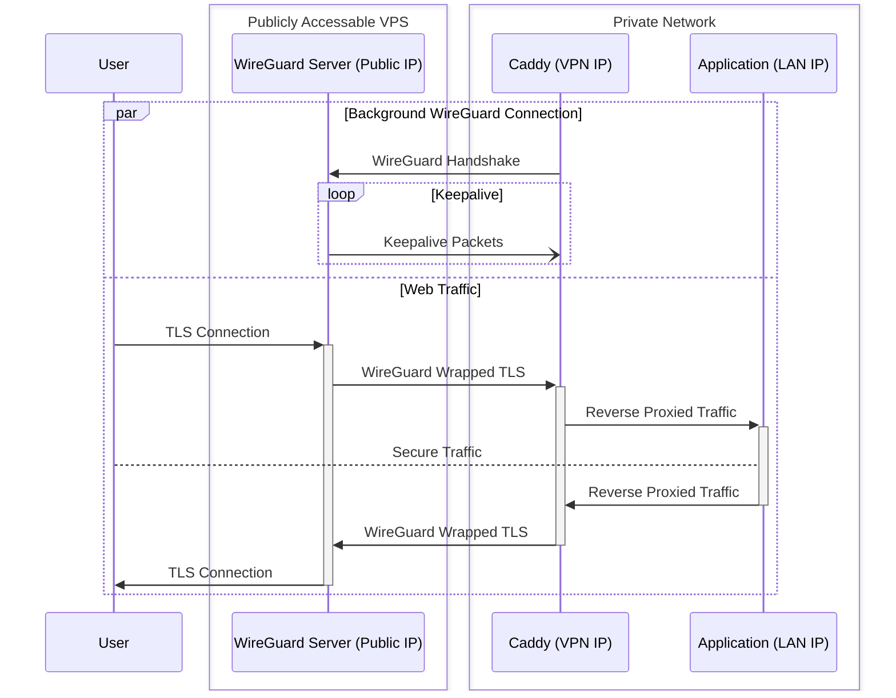

# 🔒 **point-c**: 

Seamless Integration of [Caddy](https://caddyserver.com/) with [WireGuard](https://www.wireguard.com/) in pure Go

`point-c` is designed to provide a robust and fully integrated solution for running the Caddy web server over the secure WireGuard VPN. The original motivation for starting this project was to combine the `wireguard-go` library directly with Caddy, instead of using a separate Docker container for WireGuard. The aim is to offer flexible and secure web traffic management.

🧩 **Modular Design**: The project emphasizes a modular approach, breaking down functionality into reusable packages. This modular approach enables other applications to leverage individual components of `point-c`, making it versatile and adaptable to various use cases.

🚀 **Easy Feature Extension**: The project is committed to facilitating the extension and enhancement of its functionality.

🌐 Explore the documentation and get started today to experience the synergy of Caddy and WireGuard with point-c. Secure, efficient, and ready to power web projects!

### Suggested Use Case

The primary use case for `point-c` involves setting up Caddy in a WireGuard server configuration on a VPS in the cloud, forwarding traffic to a Caddy setup in a client configuration located anywhere capable of connecting to the server. This setup allows for flexibility in changing the location or IP of the remote Caddy server at any time. This approach was necessary because my apartment's network setup prevented port forwarding.

### Why Forward Traffic Through the Tunnel?

Forwarding traffic through the tunnel ensures it is TLS encrypted before it gets wrapped by WireGuard, with complete decryption on the client side, which then re-encrypts the traffic entirely. This process guarantees that the traffic remains secure and is not exposed until it reaches the end user, whose traffic is then secured by their browser before being encrypted by the WireGuard server. This also ensures that users are unable to see the server's real IP address, while the client's real IP is forwarded to the Caddy server, which can then set the proper forwarding headers. Such an approach maintains the security of the traffic through TLS encryption, even if the WireGuard server is compromised, with TLS keys securely stored on the client side.

Here's a diagram showing the basic architecture of this approach:

### Compatibility and Security

Utilizing official WireGuard libraries ensures compatibility with any WireGuard client or server. This interoperability, combined with robust TLS encryption and the efficiency of Caddy and WireGuard, makes point-c as a powerful tool for secure and versatile web traffic management.

### Testing and Quality Assurance

Despite the project's 100% test coverage, it's important to note that `point-c` is in its early stages. Users are encouraged to use it with caution. Feedback and bug reports are highly appreciated to help improve and refine the project.

An integration test featuring [librespeed](https://librespeed.org/) benchmarks the system's performance, complementing the unit tests. This approach to testing confirms the integration of Caddy with WireGuard and helps uphold the project's goal towards speed, security, and reliability.
